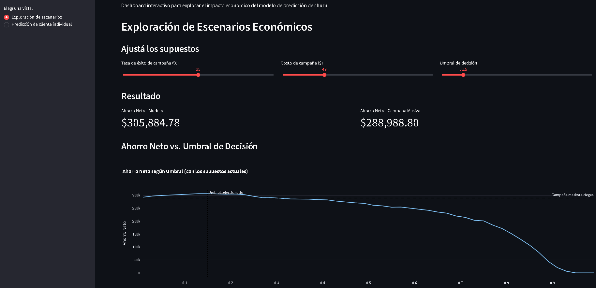
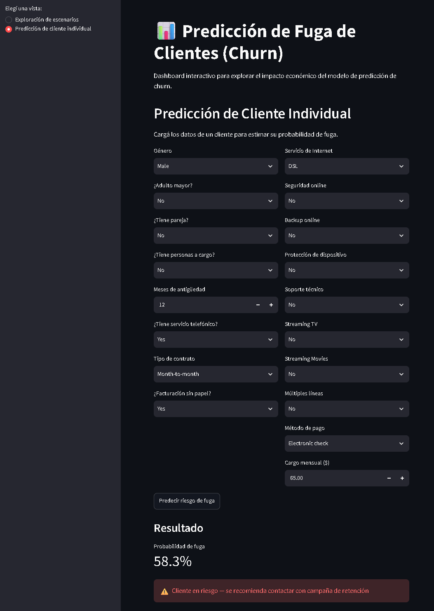

# Predicción de Fuga de Clientes (Churn) en Telecomunicaciones

Proyecto de ciencia de datos end-to-end que predice qué clientes de una empresa de
telecomunicaciones tienen mayor riesgo de darse de baja (churn), y traduce esa
predicción en impacto económico real para justificar su implementación frente al
negocio.

🔗 **[Probar el dashboard en vivo](https://telco-customer-churn-prediction-4oq8bzv5vwk3sjwsnvstgp.streamlit.app/)**


## Contexto y objetivo de negocio

El objetivo de negocio es reducir la tasa de fuga de clientes mediante la
identificación temprana de clientes en riesgo, permitiendo que el equipo de retención
actúe de forma proactiva y dirigida — en lugar de campañas masivas a ciegas o de no
actuar en absoluto.

Este proyecto responde dos preguntas centrales:

1. **¿Quién se va a ir?** — Resuelto mediante un modelo de clasificación (Regresión
   Logística) entrenado sobre el histórico de clientes.
2. **¿Vale la pena intentar retenerlos?** — Resuelto mediante un análisis de impacto
   económico que compara el costo de una campaña de retención contra el valor del
   cliente que se perdería, y determina el umbral de decisión óptimo para maximizar
   el ahorro neto.

El criterio de éxito del proyecto no es una métrica técnica aislada (como accuracy o
F1-score), sino una pregunta de negocio concreta: **¿el modelo, aplicado con lógica
económica, genera un ahorro neto positivo frente a las alternativas de no actuar o
actuar sin criterio?**

## Fuente de datos y limitaciones

El proyecto utiliza el [Telco Customer Churn Dataset de IBM](https://www.kaggle.com/datasets/blastchar/telco-customer-churn),
disponible en Kaggle — 7,043 clientes y 33 columnas en su versión extendida, incluyendo
datos demográficos, servicios contratados, información de cuenta, y variables de churn
ya calculadas por IBM (Churn Score, CLTV).

### Limitaciones del dataset

- No incluye datos de series temporales (no se conoce el mes exacto en que cada
  cliente se dio de baja), lo que impide un análisis de tendencia a lo largo del
  tiempo.
- No incluye historial de interacciones con soporte (llamadas, quejas, tickets), que
  podría aportar señales tempranas adicionales de riesgo de fuga.
- Las columnas `Churn Score` y `CLTV` fueron calculadas por IBM con una metodología no
  documentada, por lo que se excluyeron del modelo (`Churn Score`, por representar una
  predicción de otro modelo — data leakage) o se usaron solo como referencia de
  contraste (`CLTV`, comparado contra el LTV calculado de forma propia y transparente).


## Supuestos económicos

Como el dataset no incluye información financiera directa de costos de adquisición o
retención, se definieron los siguientes supuestos de forma explícita y documentada,
para que puedan ser cuestionados o ajustados con datos reales de la empresa:

| Supuesto | Valor | Justificación |
|---|---|---|
| Costo de adquisición de cliente nuevo | 5x el cargo mensual promedio (~$324.65) | Múltiplo típico en la industria de telecomunicaciones/suscripciones |
| Costo de campaña de retención | 15% del costo de adquisición (~$48.70) | Retener a un cliente existente es considerablemente más barato que adquirir uno nuevo |
| Tasa de éxito de campaña de retención | 35% | Rango típico documentado en literatura de customer success (30-40%) |
| LTV (Lifetime Value) restante | Cargo mensual × meses restantes estimados | Los meses restantes se estiman con el promedio de antigüedad de clientes que no se fueron (37.6 meses) |

Un análisis de sensibilidad (ver notebook 04) confirmó que la conclusión principal del
proyecto (el modelo supera a una campaña masiva a ciegas) se mantiene incluso ante
variaciones razonables en estos supuestos — no depende de haber elegido justo estos
valores.

## Metodología

El proyecto sigue el framework **CRISP-DM** (Cross-Industry Standard Process for Data
Mining), documentado en 4 notebooks secuenciales dentro de `notebooks/`:

1. **`01_comprension_negocio_y_datos.ipynb`** — Comprensión del negocio y auditoría de
   calidad de datos (tipos, nulos, cardinalidad, consistencia interna), con
   exploración visual de las variables más relevantes.
2. **`02_preparacion_datos.ipynb`** — Limpieza, encoding (binario, one-hot y ordinal
   según el tipo de variable) y feature engineering (creación de variables nuevas a
   partir de las existentes).
3. **`03_modelado.ipynb`** — Entrenamiento y comparación de 3 modelos de clasificación
   (Regresión Logística, Random Forest, Gradient Boosting) con **Stratified K-Fold
   Cross-Validation** (5 folds), evaluados en un set de test separado desde el inicio
   y nunca usado durante el desarrollo.
4. **`04_evaluacion_impacto_economico.ipynb`** — Traducción del desempeño de los
   modelos a impacto económico, comparación contra escenarios alternativos (no actuar,
   campaña masiva), optimización del umbral de decisión y análisis de sensibilidad.

*PENDIENTE: agregar imagen del diagrama de Excalidraw (docs/excalidraw/) ilustrando
el ciclo CRISP-DM aplicado a este proyecto.*

### Decisiones técnicas relevantes

- **Codificación ordinal** para variables con orden de negocio real (`Contract`),
  en lugar de one-hot encoding, para preservar la relación de magnitud.
- **Stratified K-Fold** en lugar de K-Fold simple, dado el desbalance de clases
  moderado del dataset (73.5% No Churn / 26.5% Churn).
- **Optimización del umbral de decisión** en función del ahorro neto económico, en
  lugar de maximizar métricas técnicas como F1-Score de forma aislada.

## Resultados

### Comparación de modelos

Se compararon 3 algoritmos de clasificación con cross-validation, seleccionando dos
finalistas por su Recall y capacidad de separación (ROC-AUC):

| Métrica | Regresión Logística | Random Forest | Gradient Boosting |
|---|---|---|---|
| Recall | 81.1% | 66.9% | 54.7% |
| Precision | 53.1% | 58.6% | 65.9% |
| F1-Score | 64.2% | 62.4% | 59.8% |
| ROC-AUC | 85.9% | 84.3% | 86.3% |

### Impacto económico

Sobre el set de test (1,409 clientes nunca vistos durante el desarrollo), se compararon
tres escenarios de negocio:

| Escenario | Ahorro Neto |
|---|---|
| No hacer nada | -$1,022,942.27 |
| Campaña masiva a ciegas | $289,415.06 |
| Campaña dirigida por modelo (umbral optimizado) | **$306,177.63** |

**Modelo final elegido**: Regresión Logística con umbral de decisión de 0.15 (en lugar
del 0.5 por default), seleccionado por generar un ahorro neto prácticamente idéntico a
Gradient Boosting, pero con mayor robustez ante variaciones en el umbral y mayor
interpretabilidad de sus coeficientes.

### Variables más relevantes

El tipo de contrato (`Contract`), la antigüedad del cliente (`Tenure Months`), el tipo
de servicio de internet (particularmente `Fiber optic`, con 41.9% de tasa de churn) y
tener personas a cargo (`Dependents`) resultaron las variables con mayor peso
predictivo, consistente con la exploración inicial en Excel y los gráficos del
notebook 1.

### Dashboard interactivo

**Exploración de escenarios** — ajuste en vivo de supuestos económicos y umbral de decisión:



**Predicción de cliente individual** — estimación de riesgo para un cliente hipotético:



## Cómo correr el proyecto

### Requisitos previos
- Python 3.10+
- pip

### Instalación

```bash
git clone https://github.com/SantiagoScozziero7/telco-customer-churn-prediction.git
cd telco-churn-prediction
python -m venv venv
venv\Scripts\activate          # Windows
pip install -r requirements.txt
```

### Estructura del proyecto
telco-churn-prediction/
├── data/
│ ├── raw/ # Dataset original (Kaggle)
│ └── processed/ # Datos limpios y transformados
├── notebooks/ # Los 4 notebooks del análisis, en orden
├── src/ # Funciones reutilizables (modeling.py, economics.py)
├── streamlit_app/ # Dashboard interactivo
├── docs/excalidraw/ # Diagrama del ciclo CRISP-DM del proyecto
└── requirements.txt

### Ejecutar los notebooks

Correr en orden desde `notebooks/`, del 01 al 04, con el entorno virtual activado.

### Ejecutar el dashboard

```bash
streamlit run streamlit_app/app.py
```

## Próximos pasos

- Incorporar datos de series temporales (fecha exacta de baja) para detectar
  estacionalidad o tendencias en el churn.
- Sumar historial de interacciones con soporte como variable predictora adicional.
- Validar los supuestos económicos (costo de campaña, tasa de éxito) con datos reales
  de Finanzas, en lugar de estimaciones basadas en literatura de la industria.
- Investigar en profundidad por qué el servicio de Fiber optic muestra una tasa de
  churn significativamente más alta que otros tipos de servicio de internet.